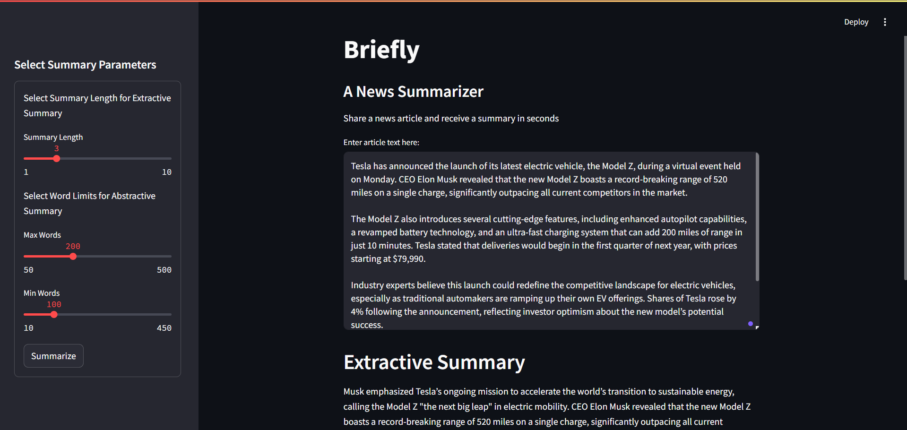

## Overview

**Briefly** is an application designed to summarize news articles both extractively and abstractively. It allows users to input articles and receive concise summaries within seconds. The app utilizes language models and natural language processing (NLP) techniques to generate summaries in various lengths and formats. 



## Usage Instructions

1. **Install Required Libraries:**
   Install the required dependencies by running:

    ```shell
    pip install -r requirements.txt
    ```

2. **Start the Application:**
   Run the following command to start the application:

    ```shell
    streamlit run app.py
    ```

3. **Access the Application:**
   Open your browser and navigate to [http://localhost:8501/](http://localhost:8501/) to access the frontend of the app.

4. **Input Article:**
   Paste the text of the news article you want to summarize in the provided text box.

5. **Configure Summary Parameters:**
   Use the sidebar to select the summary parameters, including:
   - **Summary Length for Extractive Summary:** Adjust the number of sentences in the summary.
   - **Word Limits for Abstractive Summary:** Set the maximum and minimum word count for the abstractive summary.

6. **Generate Summaries:**
   Click on the "Summarize" button to generate both extractive and abstractive summaries of the provided article.

7. **View Summaries:**
   The generated extractive summary and abstractive summary will appear below the input field.

## Key Features

- **Extractive and Abstractive Summarization:** Supports both extractive summarization (selecting key sentences) and abstractive summarization (generating new concise text) based on word frequencies and sentence scores by using a pre-trained T5 model.
- **Customizable Summary Length:** Users can adjust the length of the extractive summary by selecting the number of sentences and set word limits for the abstractive summary.
- **Built with Streamlit:** A simple and interactive user interface built using [Streamlit](https://streamlit.io/).
- **Preprocessing Pipeline:** The app processes the article text by removing stopwords, lemmatizing, and normalizing the content to improve summary quality.
- **State-of-the-Art Models:** Uses a pre-trained T5 model for abstractive summarization and a custom extractive summarization approach based on word frequencies and sentence scores.